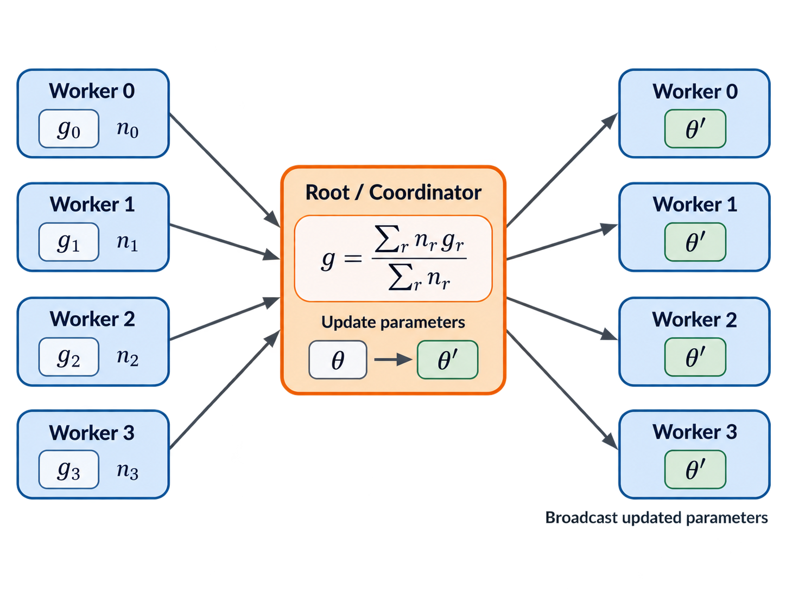
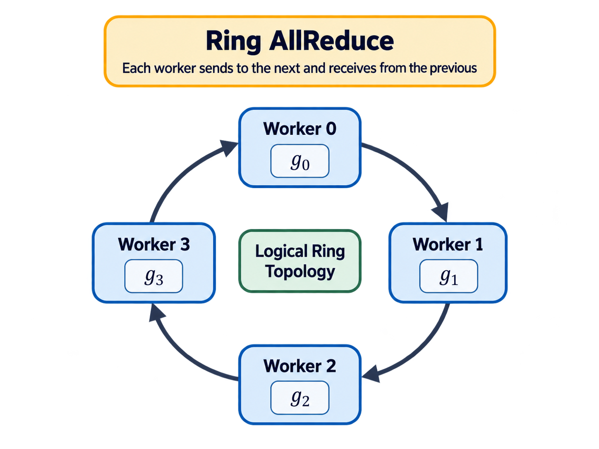
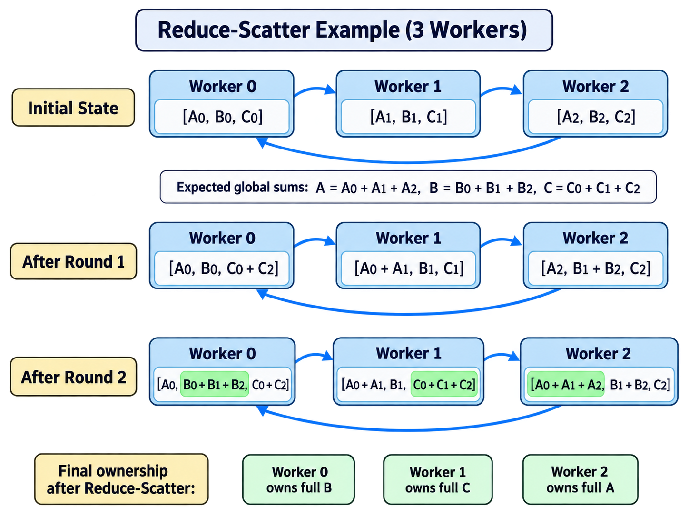
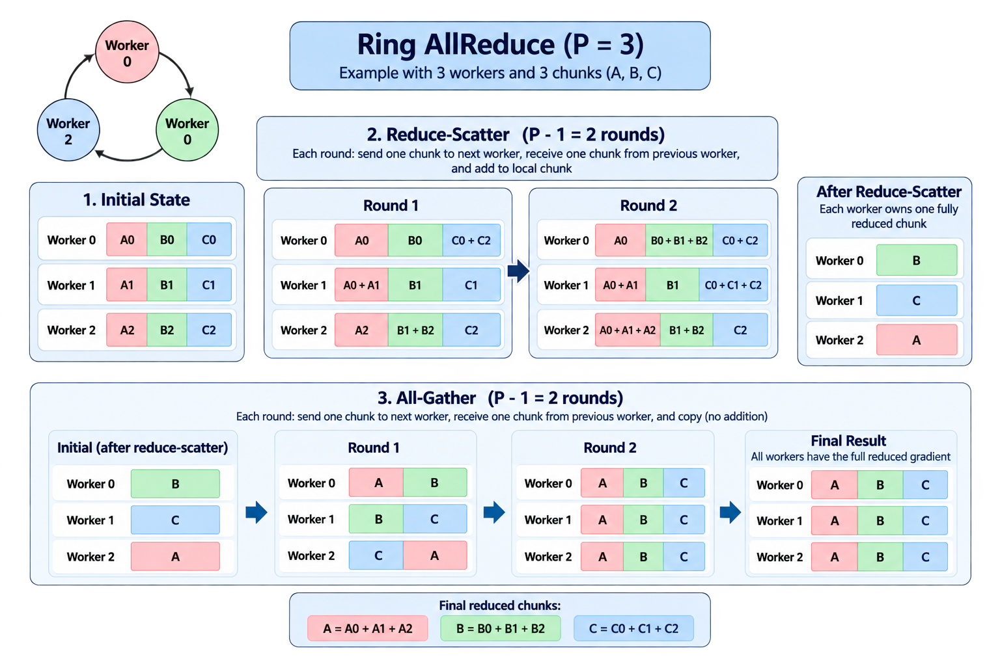

# All Reduce
## Why We Need All Reduce
### Background Information: What is Network Training
The training of a network could be simplified as the following process:  
**forward -> loss -> backward -> optimizer.step**  
Let's just assume this is supervised learning. The first step is using the training data as input and forward through each layers and finally get an output. Then we measure the difference between calculated output and data from label to get a loss. Then we use the loss to go back through the network and calculate the derivative of loss to each parameters (for example, weight, bias, ...). Then the optimizer use the formulas containing learning rate and momentum to update learnable parameters.  
This entire process could be regarded as one training step.
### What is Distributed in This Naive System
The current implementation only divides the entire input into different parts by batch while each worker keeps an entire parameter list. Because of only batch is partitioned, the linear algebra calculation will not be infected, so on each worker they can still do forward, backward and loss by just pretending the batch size of the dataset is really that small. However, in optimizer, the story has changed.  
Each worker could calculate their local loss, but optimizing requires the global loss to keep the distributed training system has shared parameters among workers otherwise it will become different networks. The challenge is how to ensure the parameters in each workers could still keeping the same after updating. Therefore, how to update parameters on different workers is the key to this problem.
## Centralized Implementation
### How It Works
The easiest way is let all workers send their gradients and batch size to one centralized optimizing center worker. The worker then calculate the weighted global loss by gathering each local gradients on different workers using their batch size as weight.
$$
L_{\text{global}}
=
\frac{
    \sum_{r=0}^{P-1} n_r g_r
}{
    \sum_{r=0}^{P-1} n_r
}
$$
After updating all parameters on this specific worker, it then broadcast the new parameters to each worker to update their parameters for next step.  

The **Gather -> Update -> Broadcast** process is called **Reduce**
### Performance of This Implementation
Let *P* be the number of workers and *S* be the size of one gradient array in bytes. During reduce, the worker for updating will receive gradients from all other workers and then broadcast new parameters to all other workers. Therefore, the total number of message is:
$$
M_{\text{root}} = 2(P-1),
$$
and the total transmission payload is:
$$
B_{\text{root}} = 2(P-1)S.
$$
The bottleneck happens on the imbalance between the high transmission pressure for the centralized worker and the low transmission pressure for other workers.
## Ring All Reduce Implementation
### How it works
This implementation organize all workers into a directed (clockwise) ring structure logically. Each worker only send data to its next worker and receive data from its previous worker. After gradients have been broadcasted, all workers run optimizer.step locally.   

Before communication, the gradient arrays are flattened into a one dimensional buffer and padded if necessary. Then, this implementation contains two phases:
1. Reduce-scatter
2. All-gather
### Reduce-scatter
1. Preparation: Assume there are *P* workers. From the beginning, each worker has their local gradients, this data will be flattened and partition into *P* chunks, each chunk only contains a part of the local gradients. This happens on all workers.
2. Ring reduction: These workers perform *P-1* communication rounds, in each round, every worker send one of its chunk to its next worker, and receives one of its previous worker's chunk. Then the worker add the received chunk to its corresponding local chunk to form a partial sum.
3. Final ownership: After *P-1* rounds, every chunk has been summed across workers. So each worker owns one fully reduced chunk.
For example, if we have three workers, then each data in the worker will be partitioned into 3 chunks. Assume the initial state:  
Worker 0: [A0, B0, C0]  
Worker 1: [A1, B1, C1]  
Worker 2: [A2, B2, C2]  
Our expected result is all A = A0 + A1 + A2, B = B0 + B1 + B2, C = C0 + C1 + C2 
There will be *P-1 = 2* rounds.  
After Round 1: 
Worker 0: [A0, B0, C0 + C2]  
Worker 1: [A0 + A1, B1, C1]  
Worker 2: [A2, B1 + B2, C2]  
After Round 2:  
Worker 0: [A0, B0 + B1 + B2, C0 + C2]  
Worker 1: [A0 + A1, B1, C0 + C1 + C2]  
Worker 2: [A0 + A1 + A2, B1 + B2, C2]  

Then, Worker 0 has the complete gradient of B, Worker 1 has the complete gradient of C, and Worker 2 has the complete gradient of A.  
### All-gather
We *P-1* rounds to spread full gradients to all workers.

### Performance of This Implementation
Let *P* be the total number of workers and *S* be the size of flattened gradients. This implementation requires *2(P-1)* communication rounds, *P-1* in reduce-scatter and *P-1* in all-gather. In each round, every worker send one chunk of size *S/P*. Therefore, each worker transfers:
$$
2(P-1)\frac{S}{P}
=
2S\frac{P-1}{P}
\approx 2S
$$
bytes in total.  