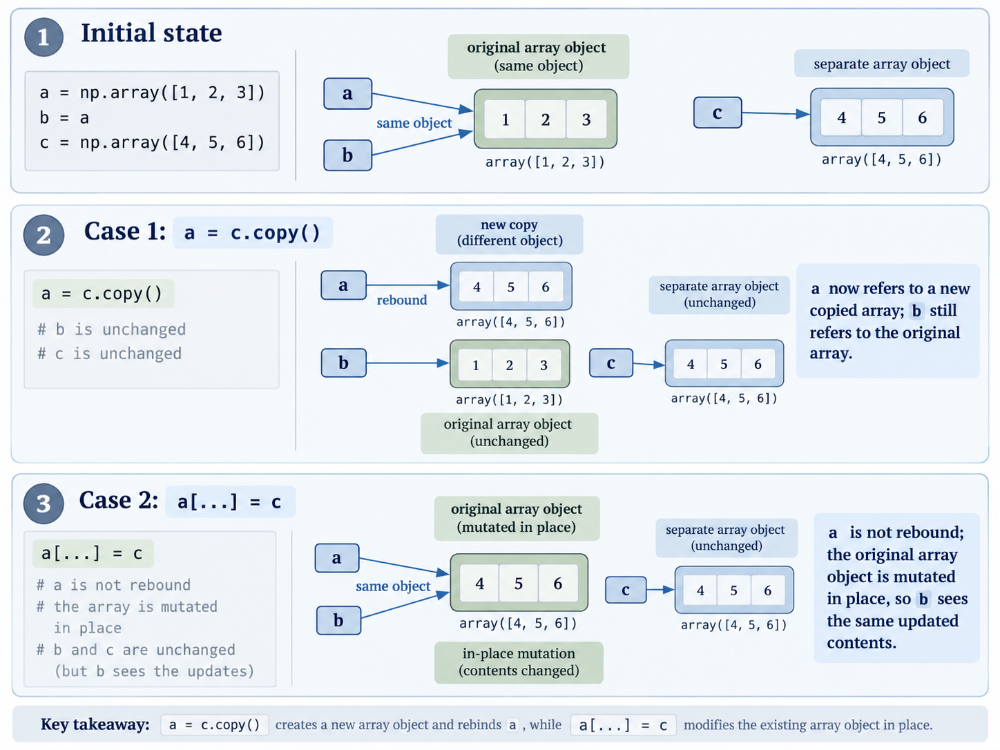

# Array Identity, Copying, and In-Place Assignment in Python
## Three methods
**In Python, variables are names bound to objects, Assignments does not necessarily copy the underlying data.**  
a = b  
a = b.copy()  
a[...] = b   

## Binding another name to the same object
**a = b** creates a new reference, not a new array. Both names refer to the same nd.array object and therefore the underlying storage. 
## Create independent storage
**a = b.copy()** creates a new nd.array with its own data storage, the values are equal in value but they are stored in different places. 
## Mutate the existing array
**a[...] = b** writes the value of b to the object pointed by a. It is different with a = b.copy() because for example if we have a = [1, 2, 3], b = a, c = [4, 5, 6]. Therefore b = [1, 2, 3]. Then:
1. If a = c.copy(): a = [4, 5, 6], b = [1, 2, 3], c = [4, 5, 6].  
What happened? We allocated a space in heap as [4, 5, 6] and let a points to it while b still points to its old value.
2. If a[...] = c: a = [4, 5, 6], b = [4, 5, 6], c = [4, 5, 6].  
What happened? We replace the value of the object pointed by a with the value of c. Therefore b still refers to the same space but the value has been changed.