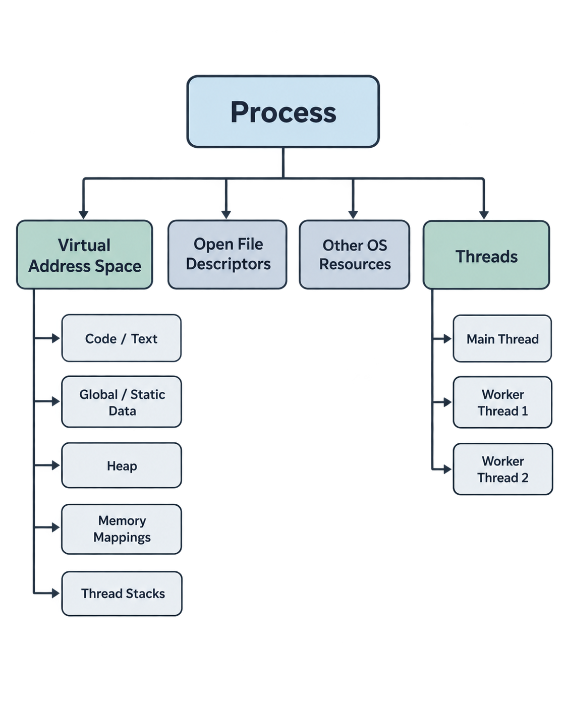
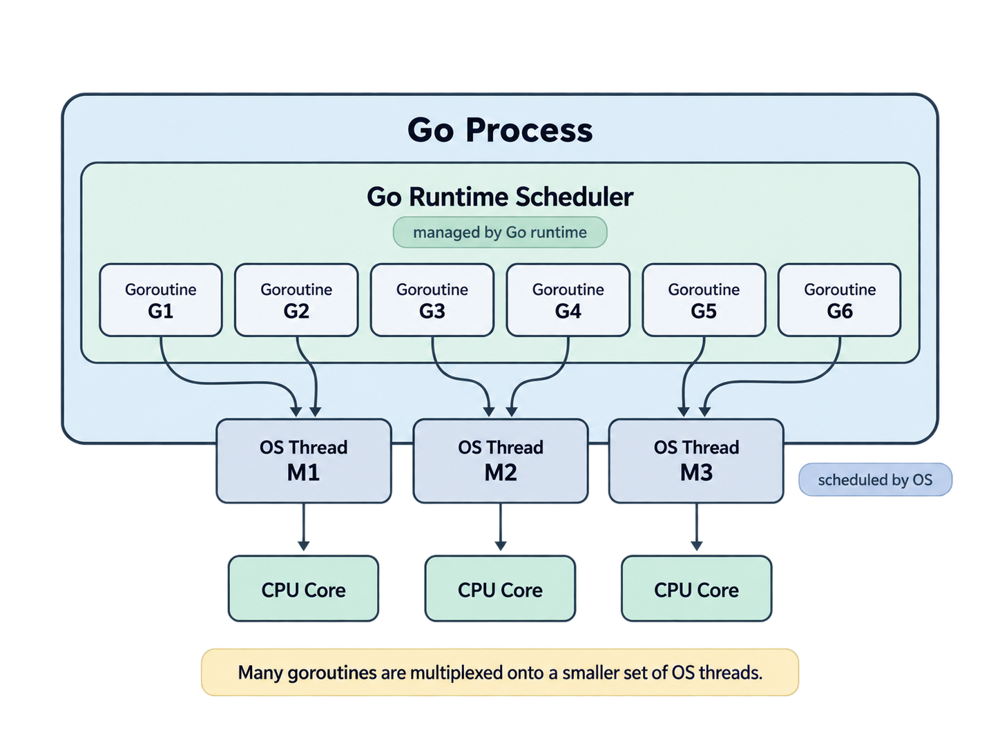
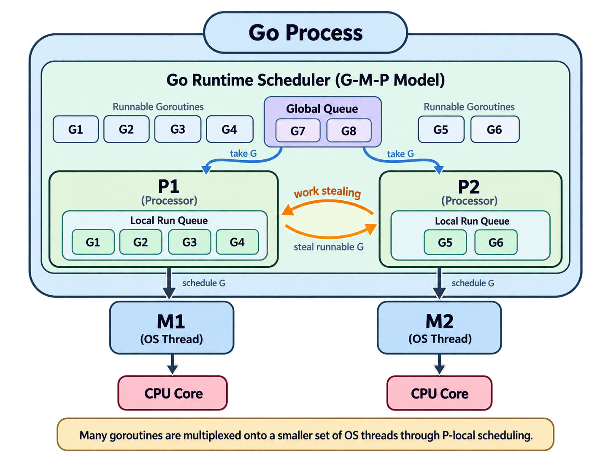
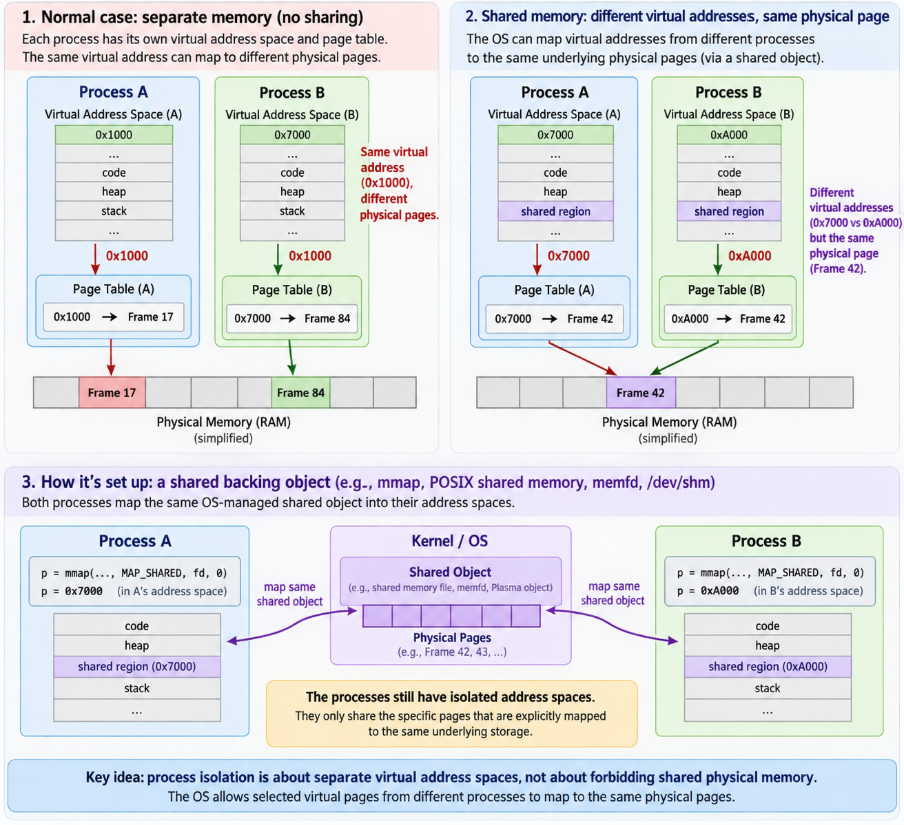

# Processes, Threads, and Goroutines: Execution Models and Memory Sharing
## Process
### What is process
A process is a running program owning its private resource (default) ensured by the OS. It has virtual address space, memory mappings, open file descriptors and other states managed by OS.
It does not execute instructions by itself, in fact, instructions are executed by thread(s) inside a process. When a process is started, it normally starts with an initial thread called the main thread and additional threads could be created later. This is an overview of the inside of process.

### Memory in process
Focus on the left side of the figure: Virtual Address Space. This is the page table / virtual memory / page fault / TLB in OS class. In short, a process sees a virtual address space, the OS and MMU translate its virtual address to physical memory through page tables.
1. Code / Text: This the machine instructions 
2. Global / Static Data: Global / Static Data storage, the lift-cycle of static local variable is the entire program.
3. Heap: Variables other than global / static data. For example:
in C, f() { int *p = malloc(sizeof(int)); *p = 10; },  
p will be stored in the stack of the stack while the int value is stored in heap of process. We can have multiple p, q, m... points to one value, which could cause race condition.
4. Memory Mappings: This means reserving a range of virtual addresses and associating that range with some underlying resource. The underlying resource could be files, shared libs, physical memory...
5. Thread Stacks: This is managed by each threads, the details will be discussed in next chapter.
## Thread
### What is thread
The main thread is initialized with the process, during running, more threads could be created. Once a thread is created, some space will be allocated for it in thread stacks area in process memory.
### Memory in thread
As the memory of thread is inside the memory space of its process, the Code / Text, Global / Static Data, Heap and Memory Mapping areas in the process is shared by threads.
A thread stack stores per-call execution state: stack frames, automatic locals, return information and temporary state needed by function calls.
## Goroutine:
### What is goroutine
A goroutine is a lightweight execution unit managed by the Go runtime rather than the OS directly.

### Memory in goroutine
Each goroutine has its own runtime managed stack. They shared the shared memory in process. Goroutine is lightweight than thread because they allocate smaller stack space than allocating a real process. Another reason is that they are scheduled by the Go runtime to coordinate goroutine with thread so multiple goroutines could be mapped to one thread (kinda like pooling?).
### Coordinating between goroutine and thread： GMP
GMP model is the coordinating method between goroutine and thread. M is the OS thread, G is each goroutine and P is the coordinator between M and G. P is attached to one M at a time, but it may connect to another M later. Another of P is a queue of G where goroutine waiting to be executed by the M through the P. There's a kind of operation called 'work stealing' which means a G waiting in the queue of one P could be stole to another P for better performance of scheduling.

## Shared Memory
### What is shared memory
Obviously 'shared memory' means multiple **processes** could access same memory which is different than the rule discussed in OS classes and books. As I know, this technique is used in RL training libraries like RLlib (based on Plasma in Ray) which allows multiple simulated environment on the same node to access large data objects without creating multiple copies.
### Why it works
Processes have isolated virtual address spaces, so how can they shared memory? The key is the 'isolation' is guaranteed by virtual address space, this does not mean that different processes can not map their virtual page to the same physical memory. Shared memory is implemented by allowing explicitly shared mappings have same underlying storage while others remain isolated.
